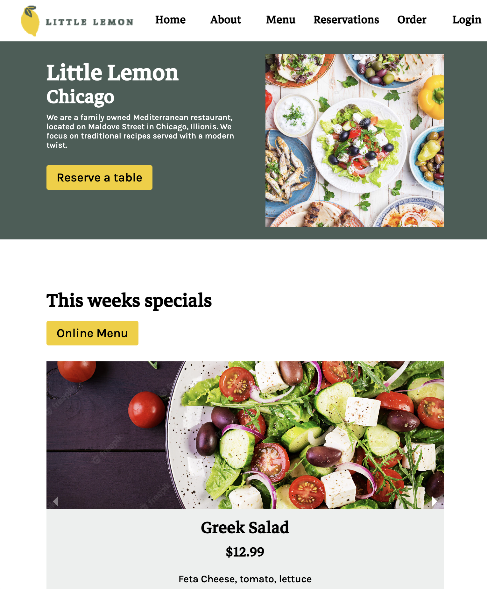
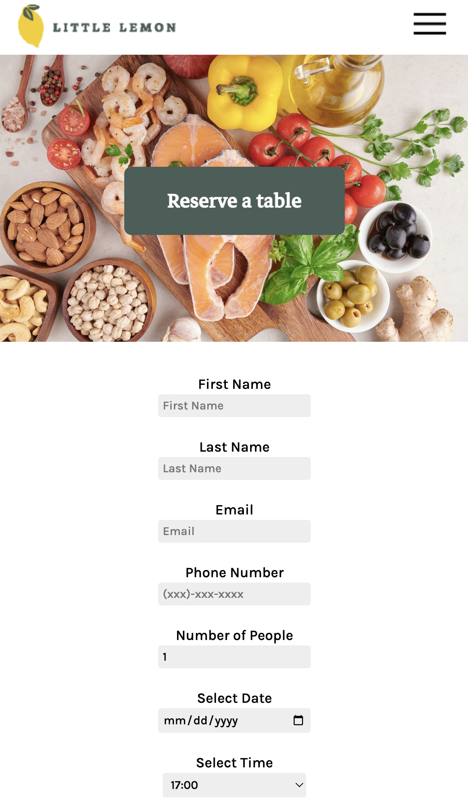

# Little Lemon Restaurant
A detailed and responsive website with table-booking functionality built using React. You can find the deployed website [here:](https://aprilschen.github.io/Little-Lemon-Restaurant/)

##### Note: 
Deployment on Github resulted in some issues, so the link above redirects you to an page on the website without any content. Simply click on the "Home" button on the navbar to be redirected to the main site.

### Tech Stack:
 - HTML, CSS
 - JSX
 - React

### Third Party Libraries & APIs:
 - react-router-dom
 - react-responsive-carousel
 - Meta front-end table-booking API

### Install and Run:
 - Run 'npm start' on the reserve-a-table folder
